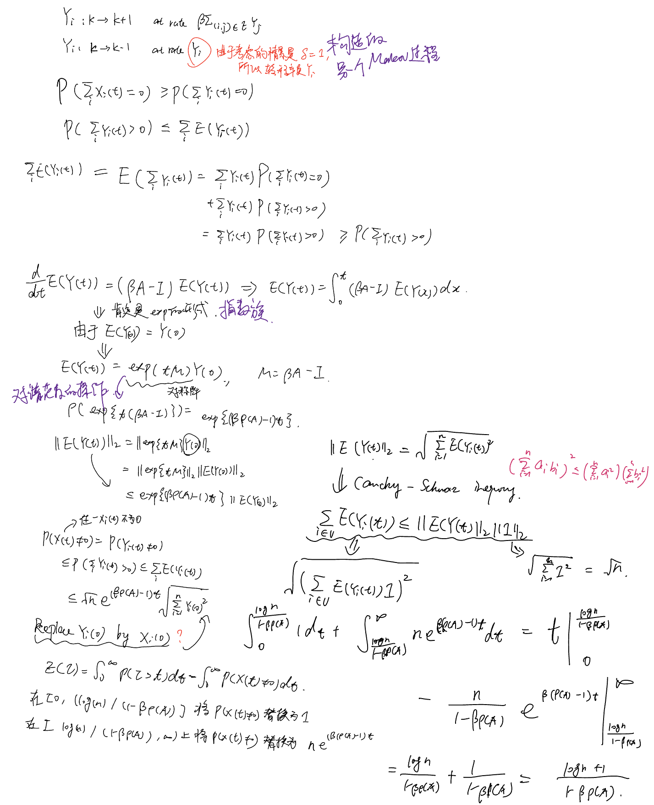
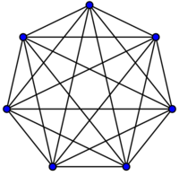
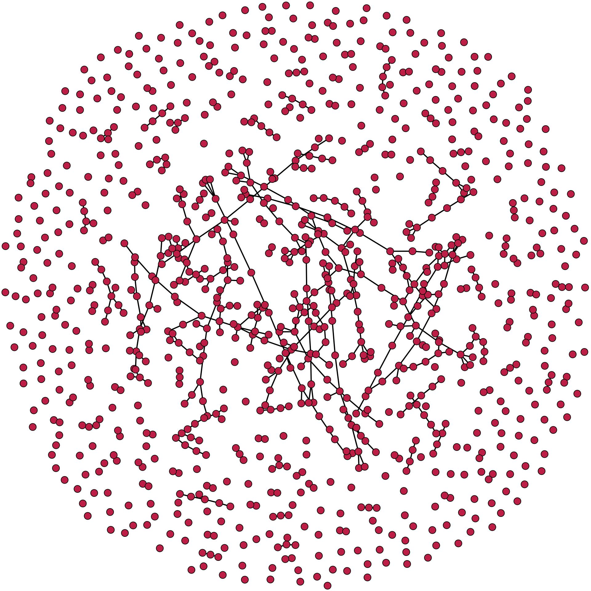
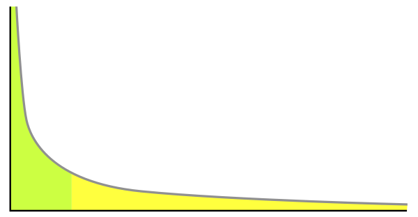

# The Effect of Network Topology on the Spread of Epidemics

## 文章简介

这篇文章发表于2005年，目前的引用量973。作者A. Ganesh, L. Massoulié来自于英国的Microsoft Research，D. Towsley来自于University of Massachusetts, Amherst。

## 文章结论

确定了图的拓扑属性,这些属性决定了疫情的持续时间。

The question of interest is then: how quickly do the epidemics die out, or how quickly does the system recover from the epidemic? 关注的是流行病消亡的速度，即平均疫情寿命 $E[\tau]$ 随系统大小 $n$ （节点数量）的变化行为，特别关注它是快速消亡还是缓慢消亡。

如果治愈率与感染率的比值小于图的谱半径，那么平均疫情寿命就是 $O(\log n)$ 量级的。如果这个比值大于图的广义等周长常数，那么平均疫情寿命就是 $O(e^{n^a})$ 量级的，其中 $a$ 是一个正常数。

## 建模

感染模式：**SIS (Susceptible-Infective-Susceptible)** 

考虑**连续时间**的epidemic spread model. 网络被表示为一个连通图 $G = (V,E)$ 其中 $V$ 是节点的集合， $E$ 是连接节点对的边的集合。每个节点可以是感染的或健康的。在任意时间 $t$ ，网络的状态可以用一个向量 $X(t)$ 来表示，如果节点 $i$ 在时间 $t$ 被感染，则 $X_i(t)=1$ 否则为 $0$ 。假设感染的节点以速率 $\beta$ 感染其邻居节点，并且以速率 $\delta$ 从感染状态回到健康状态。

定义一个如下的马尔可夫过程： 

 $X_i:0 \to 1$ at rate $\beta\Sigma_{(j,i)\in E}X_j$

 $X_j:1 \to 0$ at rate $\delta$

作者之后设定了 $\delta=1$ ("without loss of generality"🤨)，因此在这个情景设置中epidemics always die out。Even more is true: the probability that they have not died out by time $t$ will decay exponentially with $t$ . This fact follows from standard theory of Markov processes with absorbing states.

$\tau$ 的定义：the time until the epidemic dies out provided there is at least one infected node initially.

## Methodology

### A SUFFICIENT CONDITION FOR FAST RECOVERY

The condition

$$
\rho(A)<\frac{1}{\beta}
$$

implies that the epidemic dies out fast, and the characteristic time before extinction is related to the difference between the two terms.

**Theorem 3.1:** Suppose condition holds. Then, the probability that the epidemic has not died out by time $t$ , given the initial condition $X(0)\in \{0,1\}^V$ , admits the following upper bound:

$P(X_t \neq 0) \leq \sqrt{n||X(0)||_1}e^{(\beta\rho(A)-1)t}$

Where $||X(0)||_1=\Sigma_{i=1}^{n}X_i(0)$. In addition, the time to extinction $\tau$ verifies

 $E(\tau)\leq\frac{\log (n)+1}{1-\beta\rho(A)}$ 

for any initial condition, $X(0)$.

在计算复杂性理论中，问题可以被认为是要解决的计算任务。归约关系描述了一个问题是否可以通过对另一个问题进行某种转换来解决。具体而言，如果问题 A 可以在多项式时间内转换为问题 B，那么我们说问题 A 可以在多项式时间内可规约到问题 B，记作 A $\leq_{st}$ B。

### SUFFICIENT CONDITION FOR LASTING INFECTION

定义

 $\eta(G,m)=\inf_{S\subset \{1,2,\dots,n\},|S|\leq m}\frac{E(S,\bar{S})}{|S|}$ , $0 < m \leq \lfloor n/2 \rfloor$ 

为generalized isoperimetric constant. 这里考虑的是特定子集，当 $m=\lfloor n/2 \rfloor$ 时，此时就是计算的standard isoperimetric constant. 具体来说，等周常数(standard isoperimetric constant)是图的一个子集的边数与子集大小的比值的最小值，这个比值反映了子集与图其余部分的“隔离程度”。 上面的定义式对子集里的顶点数量做了限制。

现在定义一个这样的Markov Process:

 $z:0 \to 1$ at rate $\eta(m)\beta z$

 $z:1 \to 0$ at rate $z$

## 实验

### *Star-shaped networks*

Star-shaped networks（星形网络）是一种特殊类型的网络拓扑结构，其中一个中心节点直接连接到所有其他节点，而其他节点之间没有直接的连接。

星形网络在通信、传输、控制和分布式系统等领域中有广泛应用，同时也是研究网络拓扑和网络动力学的重要模型之一。

### *Hypercubes*

超立方体是在更高维空间中推广的概念。n维超立方体由 $2^n$ 个顶点、 $2^n$ 条边、 $2^{(n-1)}$ 个面以及1个 $n$ 维的超立方体形成。它的每个顶点与其他顶点相距1个单位，通过边相连。每个面都是由共享 $n-1$ 个顶点的一组边组成。

超立方体在计算机科学中具有重要意义，特别是在并行计算和分布式系统中。它被用作连接结构，用于构建多处理器系统、网络路由算法和数据存储方案。此外，超立方体也在数学、图论和拓扑学中被广泛研究和应用。

### *Complete graph*

Complete graph（完全图）是图论中的一个概念，表示一个具有最大连接性的简单无向图。在完全图中，每对节点之间都存在一条边，即任意两个节点之间都直接相连。

### *Erdo ̋s-Rényi random graphs*

在Erdős-Rényi随机图模型中，图的节点数为 $n$ ，图中的每对节点以概率 $p$ 相互连接，独立地决定是否存在边。这意味着每条边以独立且相等的概率 $p$ 存在于图中，而不存在边的概率为 $1-p$ 。这个模型通常表示为 $G(n, p)$ ，其中 $n$ 是节点数量， $p$ 是连接任意两个节点的概率。

是研究随机图性质和图论问题的重要工具。它可以用于分析图的连接性、聚类性、分布特性和阶段转变等问题。该模型在分析网络结构、社交网络、互联网拓扑等领域中得到广泛应用，并为研究图的随机性质提供了基础。

### *Power law graphs*

Power law graphs（幂律图）是一类拥有幂律分布特征的图形结构。在这类图中，节点的度数（即与节点相连的边的数量）遵循幂律分布，也就是度数较小的节点数量远远多于度数较大的节点数量。
这种图形结构在许多实际系统中都有所观察，例如社交网络、互联网拓扑、科学引用网络和许多其他复杂网络。幂律图的出现意味着存在少数重要的节点（称为“骨干节点”或“关键节点”），它们在网络中具有显著的影响力和连接性。

