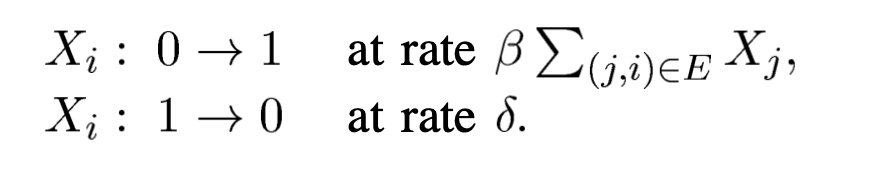
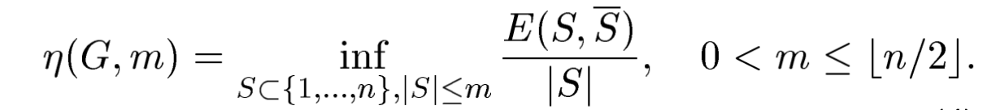

# The Effect of Network Topology on the Spread of Epidemics

## 文章简介

这篇文章发表于2005年，目前的引用量973。作者A. Ganesh, L. Massoulié来自于英国的Microsoft Research，D. Towsley来自于University of Massachusetts, Amherst。

## 文章结论

确定了图的拓扑属性,这些属性决定了疫情的持续时间。

The question of interest is then: how quickly do the epidemics die out, or how quickly does the system recover from the epidemic? 关注的是流行病消亡的速度，即平均疫情寿命 $E[\tau]$ 随系统大小 $n$ （节点数量）的变化行为，特别关注它是快速消亡还是缓慢消亡。

如果治愈率与感染率的比值小于图的谱半径，那么平均疫情寿命就是 $O(\log n)$ 量级的。如果这个比值大于图的广义等周长常数，那么平均疫情寿命就是 $O(e^{n^a})$ 量级的，其中 $a$ 是一个正常数。

## 建模

感染模式：**SIS (Susceptible-Infective-Susceptible)** 

考虑**连续时间**的epidemic spread model. 网络被表示为一个连通图 $G = (V,E)$ 其中 $V$ 是节点的集合， $E$ 是连接节点对的边的集合。每个节点可以是感染的或健康的。在任意时间 $t$ ，网络的状态可以用一个向量 $X(t)$ 来表示，如果节点 $i$ 在时间 $t$ 被感染，则 $X_i(t)=1$ 否则为 $0$ 。假设感染的节点以速率 $\beta$ 感染其邻居节点，并且以速率 $\delta$ 从感染状态回到健康状态。

定义一个如下的马尔可夫过程：

作者之后设定了 $\delta=1$ ("without loss of generality"🤨)，因此在这个情景设置中epidemics always die out。Even more is true: the probability that they have not died out by time $t$ will decay exponentially with $t$ . This fact follows from standard theory of Markov processes with absorbing states.

$\tau$ 的定义：the time until the epidemic dies out provided there is at least one infected node initially.

## Methodology

### A SUFFICIENT CONDITION FOR FAST RECOVERY

The condition

$$
\rho(A)<\frac{1}{\beta}
$$

implies that the epidemic dies out fast, and the characteristic time before extinction is related to the difference between the two terms.

### SUFFICIENT CONDITION FOR LASTING INFECTION

定义

为generalized isoperimetric constant. 

## 实验

### *Star-shaped networks*

### *Hypercubes*

### *Complete graph*

### *Erdo ̋s-Rényi random graphs*

### *Power law graphs*