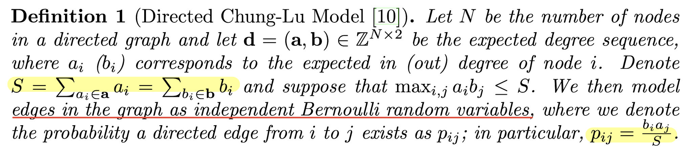
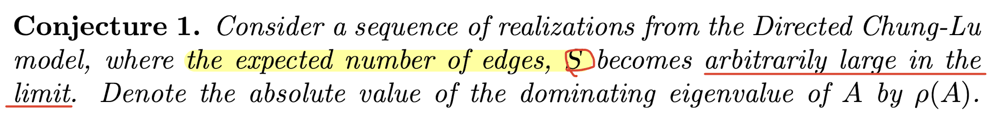
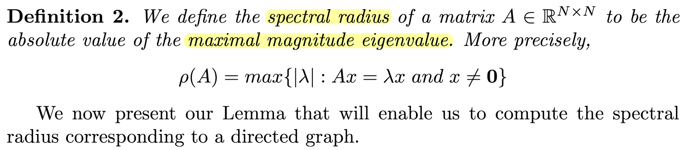
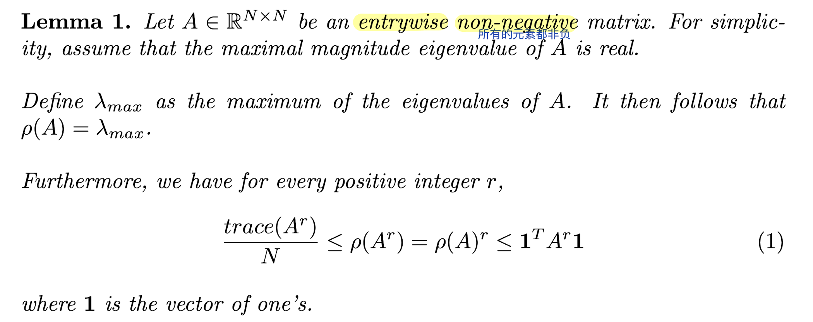
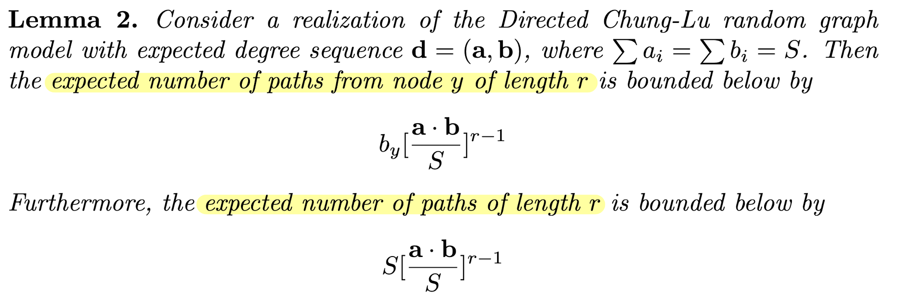
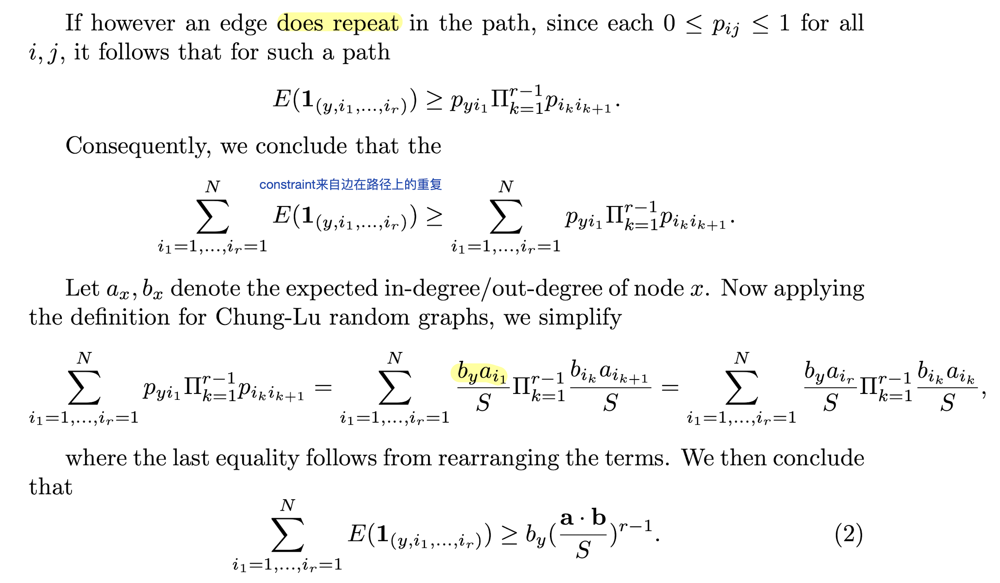
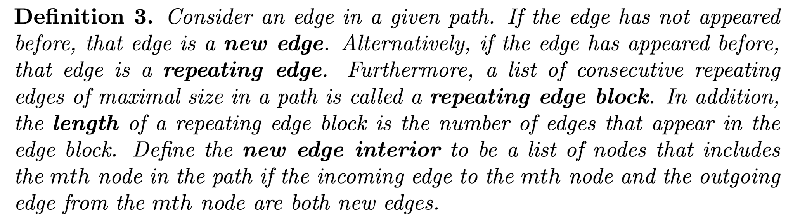
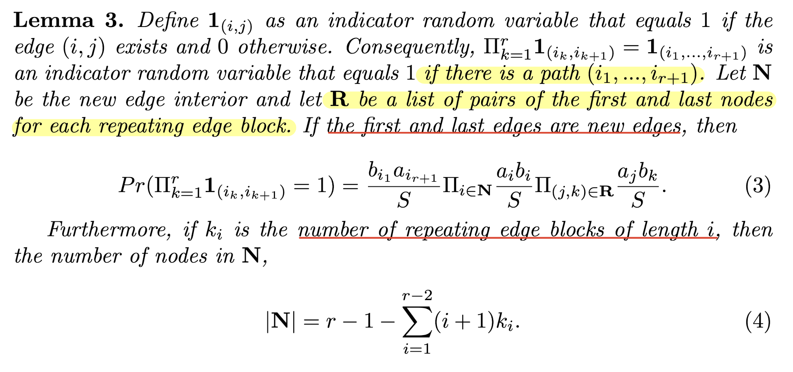

# Asymptotics of the spectral radius for *directed* Chung-Lu random graphs with community structure

[TOC]

## 0 Definitions and the Conjecture

这是对Chung-Lu random graphs的定义。CL随机图边存在的概率依赖于顶点的入度与出度：

**以下是本文的核心推论，后面都围绕这个结论是否成立，在什么条件下成立所展开**

接着给出了推论中谱范数的定义：

这里的引理1给出的是一个有物理含义的上下界

其中上界的 $\mathbf{1}^TA^r\mathbf{1}$ 表示了所有长度为r的路径数量，下界 $\frac{trace(A^r)}{N}$ ( $trace(A^r)=\Sigma_{j=1}^Ne_j^TA^re_j$ )表示了所有长度为r的圈的数量➗了 $N$ 。

Then we can use concentration inequalities, like Markov’s Inequality or Chebyshev’s Inequality, to show that with high probability the number of cycles of length $r$ must be close to the quantity, $C (\frac{\mathbf{a}·\mathbf{b}}{S} )^r$ . Furthermore, $C$ satisfies the constraint that $\frac{1}
{N^3} ≤ C ≤ 1$ . 从而由引理1，$C^{\frac{1}{r}}(\frac{\mathbf{a}·\mathbf{b}}{S} ) \leq \rho(A)$  . 代入 $r = O(log(N)^{1+\delta})$，当 $\delta>0$ 的时候，可以保证 

$$
\lim_{N\to\infty}\sup\frac{C^{\frac{1}{r}}(\frac{\mathbf{a}·\mathbf{b}}{S} )}{\rho(A)}=\lim_{N\to\infty}\sup\frac{(\frac{\mathbf{a}·\mathbf{b}}{S})}{\rho(A)}\leq 1
$$

## 1 $\frac{\mathbf{a}·\mathbf{b}}{S}\to \infty$​

在第2节中，作者阐述了如何通过路径计数来得到Chung-Lu模型在 $\frac{\mathbf{a}·\mathbf{b}}{S}\to \infty$ （即节点的预期入度向量和出度向量的点积与网络大小的比值趋向于无穷大）时谱半径的集中不等式和渐近性质。具体来说，为了计算路径和循环（cycles）数量的矩的界限，作者证明了引理3。这个引理允许他们有效地计算路径存在的概率，即使是在路径中多次重复访问同一边（edge）的情况下。

引理看起来是一个递归的结论，下面的式子可以由上面的式子加和得到。上式的第一项是$y$的出度，是一个路径中所有可能得第一个点。

**定义3：**

- 新边**(new edge)**和重复边**(repeating edge)**：在给定路径中，如果边是第一次出现，那么它被称为新边。如果边之前已经出现过，那么它被称为重复边。

- 重复边块**(repeating edge block)**：如果在路径中存在连续的重复边，那么这些连续的重复最大边被称为一个重复边块（repeating edge block）。重复边块的长度是指块中出现的边的数量。

- 新边内部**(new edge interior)**: 是指在路径中，如果一个节点的进入边（incoming edge）和出去边（outgoing edge）都是新边，那么这个节点就属于新边内部。在路径长度为 $r$ 的情况下，如果路径中的第 $m$ 个节点（其中 $2\leq m\leq r$ ）的前一条边和后一条边都是新边，那么我们说第 $m$ 个节点属于新边内部。

引理3根据结构容易归纳得到的。

 **????????** [P8] If the last edge is indeed a repeating edge, then we also know that the last edge has to equal the first edge.

**Answer:** 这个repeating是由观测顺序定义的。where we observe the first edge in the path first, then we observe the last edge in the path. After that, we observe the second edge in the path, followed by the third edge in the path, etc. **不过这也行？**

感觉很奇怪，在计数的时候把最后一条边的顺序放在了第二位。

Now define $Pr (y)$ to be the number of paths of length $r$ starting at node $y$ and $C_r (y)$ to be the number of cycles of length $r$ starting at node $y$. Furthermore, denote $P^L_r (y)$ to be the number of paths of length $r$ where the last edge is a new edge.

## 2 $p_{max}=max_{i,j}\frac{\mathbf{a}·\mathbf{b}}{S}\to \infty$

## 3 Partitioned Chung-Lu model

在第4节中，作者介绍了分区Chung-Lu模型（Partitioned Chung-Lu model），该模型允许网络中存在社区结构。引入社区结构使得模型更加灵活，但同时也使得分析变得更加具有挑战性，因为需要考虑到两个节点之间是否存在边的概率取决于这两个节点的社区成员身份。
为了解决这个问题，作者在第13引理（Lemma 13）中展示了如何将路径数量的总和表示为矩阵-向量乘积的范数，并提供了第2节和第3节结果的扩展。具体来说，这意味着他们找到了一种方法来计算和分析网络中路径的数量，即使在节点的社区成员身份影响它们之间连接概率的复杂情况下。