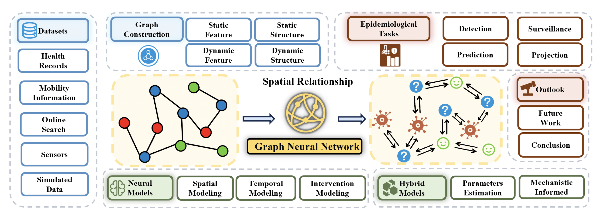

# A Review of Graph Neural Networks in Epidemic Modeling 

这是一篇关于GNN在Epidemic Modeling方面的综述文章，来自Wei Jin老师的Emory Melody Lab.

## Epidemiological Tasks

four categories based on researchers’ goals: Detection, Surveil- lance, Prediction, and Projection

### Detection

The goal of detection tasks is to identify health states, disease spread, or other related incidents that happened at a speciic time.

*source detection* and *transmission detection*

**数学表述：** 给定一个时间维度的图序列 $G = \{G_0, G_1,\dots, G_T\}$ , 其中 $G_t$ 的顶点和边的状态可以表示为 $S_t^V$ 和$S_t^{\varepsilon}$ . Detection的任务可以表示为给定 $G_T$ 和 $t$ ，预测 $S_t^V$ 和 $S_t^{\varepsilon}$ .

### Surveillance

Surveillance tasks aim at providing **timely** and accurate information to support decision-making and disease prevention. Since a prompt response is needed, **real-time** processing ability has been the most important requirement during modeling. 

**数学表述：** 给定一个时间维度的图序列 $G = \{G_0, G_1,\dots, G_T\}$ , 快速计算 $G_T$ 上的一个统计量 $Y$ .

### Prediction

Similar to surveillance tasks, prediction tasks also aim to forecast epidemic events using historical data. Prediction tasks typically involve **longer time spans** and **do not require real-time processing**.

**数学表述：** 给定一个时间维度的图序列 $G = \{G_0, G_1,\dots, G_T\}$ , 预测 $G_{T+1}$ .

- *Incidence Prediction.* The target of incidence prediction is to provide quantitative result. 
  - Incidences can include the number of infections or deaths in the future, inluenza activity level, InluenzaLike Illness (ILI) rates, vaccine hesitancy, etc.
- *Trend Prediction.* The target of trend prediction tasks is to identify a higher-level epidemic spreading pattern.
  - prediction of infection trend can be described as an information retrieving problem and the goal is to predict the next region to be infected given a historic spreading route.

### Projection

In epidemic forecasting, projection tasks are similar to prediction, but with an additional intention to understand epidemic outcomes. These tasks usually require models with the ability to **incorporate changes during the evolving of epidemics**, such as external interventions and changing of initial states.

**数学表述：** 给定一个时间维度的图 $G = \{V(t), \varepsilon(t)\}$ , 策略 $P_v(t)$ 和策略 $P_{\varepsilon}(t)$ 分别影响图的顶点状态和连接状态。目标是寻找最大化或最小化目标的最优策略。

比如说如何限制疾病扩散，applying quarantine level to nodes or restricting mobility on edges.

### Perspectives from Data Scientists

- **模型输入** 输入都为节点特征以及图结构。从时空上进行分类可以分为 **spatial- only tasks**, **temporal-only**, and **spatial-temporal tasks.** 对于graph structure的时效性和学习性上，可以使用**static**和**dynamic**特征进行区分。
- **模型输出**  scalar, graph, and action sequence. 

## Graph Construction 

