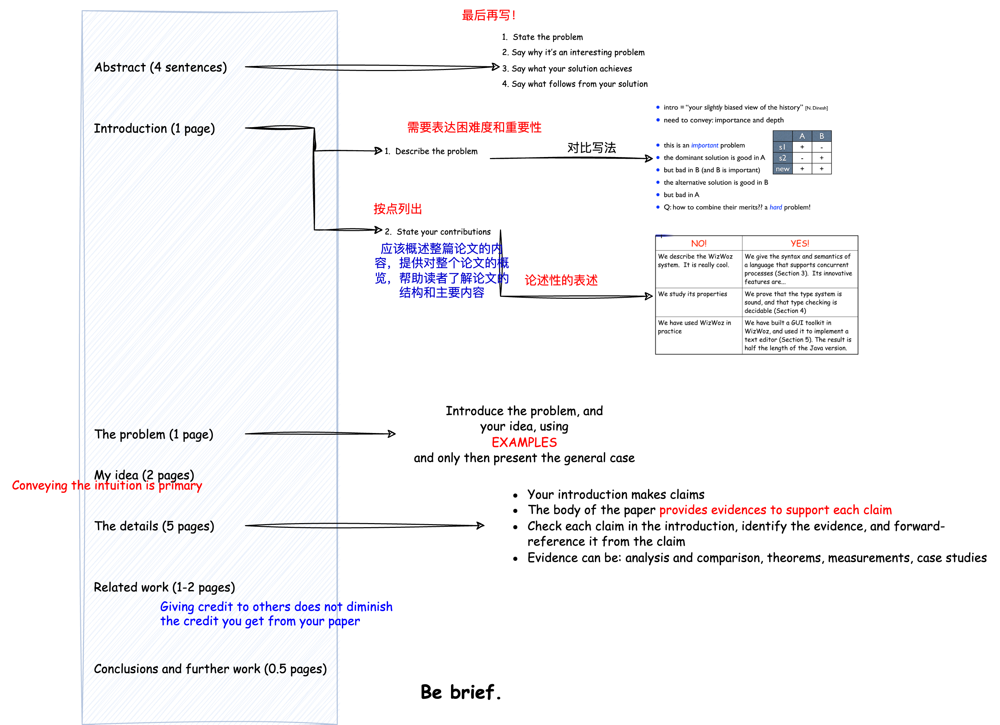
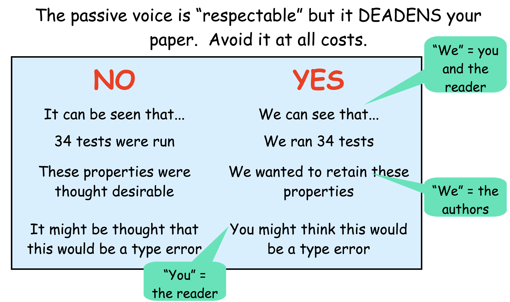

# How to Write a Good Paper and How to Give a Good Talk

## How to Write a Good Paper

**truth: learn from anybody whom you can learn from** 

Write a paper, and give a talk, about any idea, no matter how weedy and insignificant it may seem to you

 talk, write as early as you can; don’t wait until you feel ready; it doesn’t mean you have to publish it

**The process** 

- Start early.  Very early.
- Collaborate
- Use CVS(版本控制) to support collaboration

**Language and style**

- Visual structure

- Use the **active** voice

  

- Use simple, direct language

## How to Give a Good Talk

**Your talk is the Advertisment of you paper.**

Talk的目的是给audiences直观；是吸引audiences去读论文；是调动audiences的情绪

**Main Weapons**

- Examples
  - To motivate the work
  - To convey the basic intuition
  - To illustrate The Idea in action
  - To show extreme cases
  - To highlight shortcomings
- Visualization

**What to leave out**

- No **outline**! “Outline of my talk”: conveys near zero information at the start of your talk
- Do not present **related work**
- Omit **technical details**

准备pre

- Polish your slides the night before
- **Be enthusiastic**

- Be Fun -- Three Jokes Rule
  - one at the beginning (motivation)
  - one at the middle (to wake up people)
  - and one at the end
- Use a wireless presenter
- Face the audience—avoid looking and pointing at your laptop;look at the audience (70%), screen (25%), and laptop (5%)
- Absolutely without fail, **finish on time**