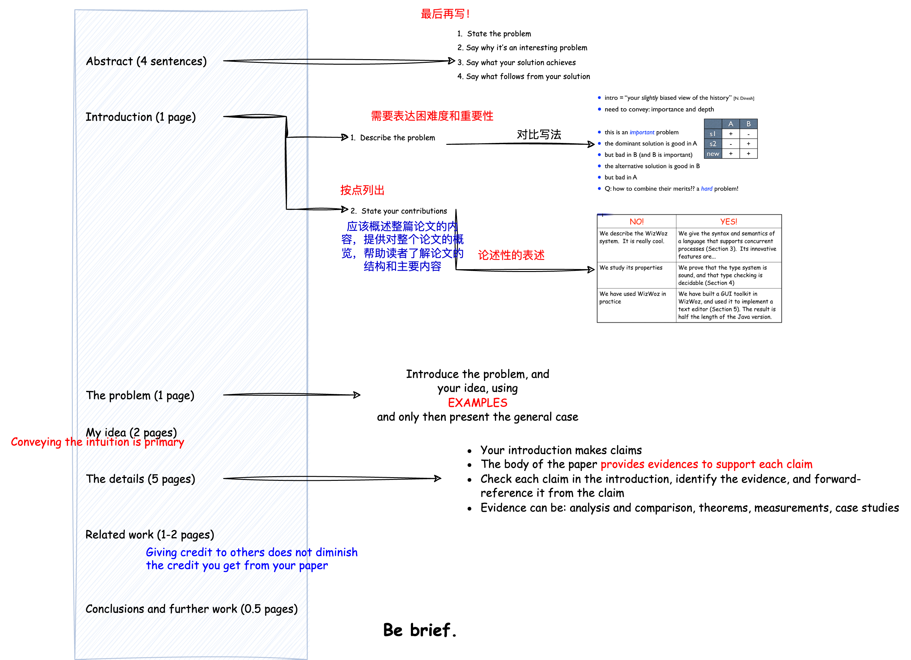

## How to Write a Good Paper and How to Give a Good Talk

### How to Write a Good Paper

**truth:** learn from anybody whom you can learn from 

Write a paper, and give a talk, about any idea, no matter how weedy and insignificant it may seem to you

 talk, write as early as you can; don’t wait until you feel ready; it doesn’t mean you have to publish it

**The process** 

- Start early.  Very early.
- Collaborate
- Use CVS(版本控制) to support collaboration

**Language and style**

- Visual structure

- Use the **active** voice

  

- Use simple, direct language